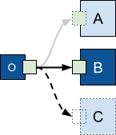

# risefront

[](https://pkg.go.dev/code.pfad.fr/risefront)

`code.pfad.fr/risefront` is a package for gracefully upgrading the server behing a tcp connection with zero-downtime (without disturbing running transfers or dropping incoming requests).

The name is meant to be the opposite of fallback (since it switches to a new executable when asked to do so).

Inspired by [overseer](https://github.com/jpillora/overseer), but re-engineered to also work on windows!




## Usage

```go
risefront.New(ctx, risefront.Config{
    Addresses: []string{":8080"}, // addresses to listen to
    Run: func(l []net.Listener) error { // listeners, for you to use
        s := http.Server{
            Handler: http.HandlerFunc(func(w http.ResponseWriter, r *http.Request) {
                w.Write([]byte("hello world " + strconv.Itoa(os.Getpid()) + "\n"))
            }),
        }
        defer s.Shutdown(context.Background()) // needed to ensure proper cleanup of children

        fmt.Println("READY", l[0].Addr()) // some logging to show that it works
        defer fmt.Println("BYE", l[0].Addr())

        return s.Serve(l[0])
    },
})
```

## Underlying logic

When you start multiple instances of the code above:

- the first one (the parent `o`) will actually listen to the addresses and call `Run`
- when a second instance (child `A`) is started, it detects that a parent is already running
  - it creates some random sockets to locally listen to
  - it informs the parent, that it wants to take over
  - it calls `Run` with those "proxy listeners"
  - from now on, the parent will forward all new connections to those "proxy listeners"
- if a third instance is started  (child `B`), the same steps happen and the second instance will exit after handling its last request
